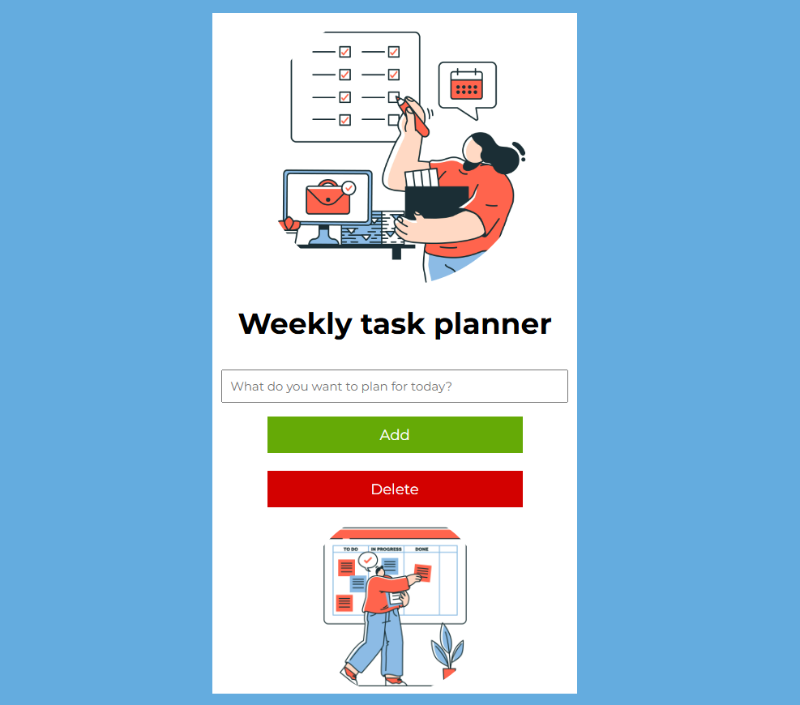
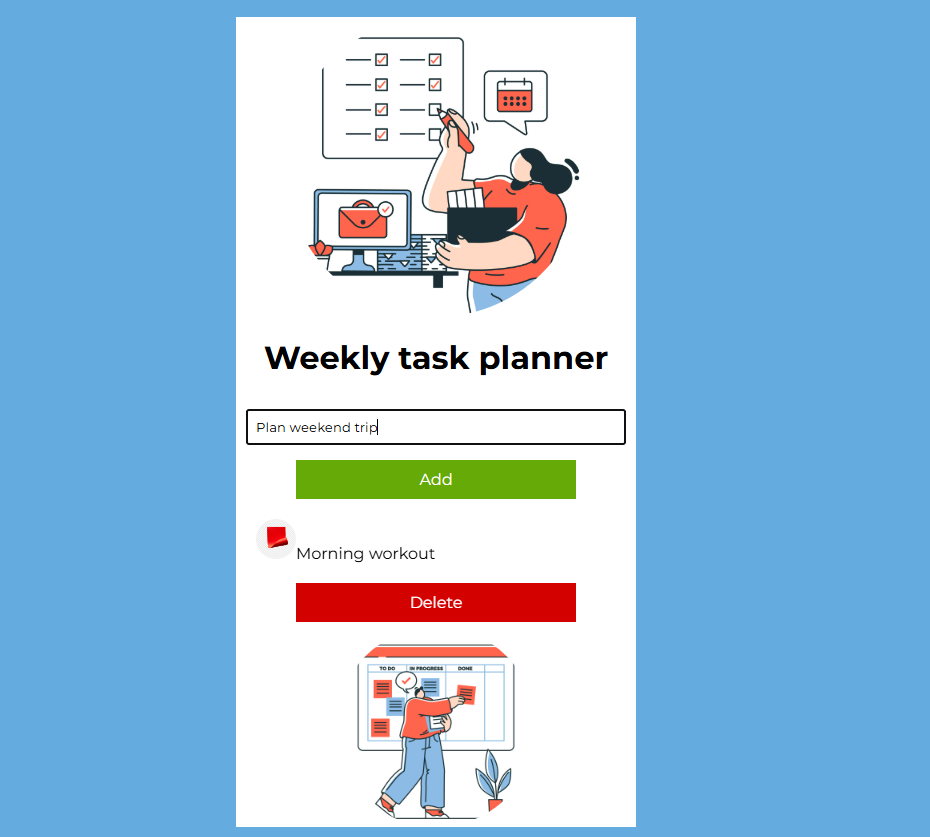
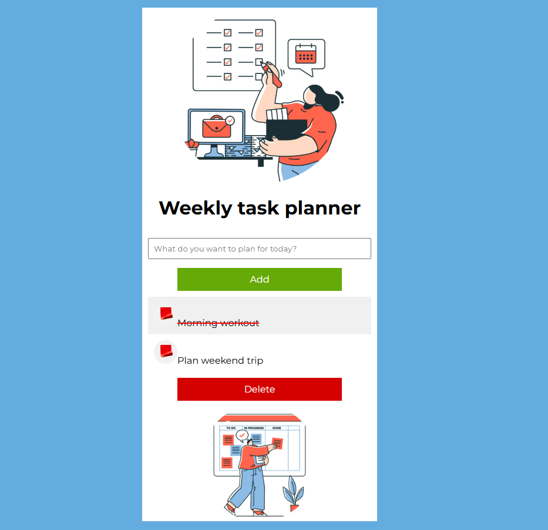

# 🗓️ Weekly Task Planner

## 🏷️ Project Title  
**Weekly Task Planner** — a convenient web application for planning and managing weekly tasks.

## 📝 Description  
Weekly Task Planner helps users efficiently organize their tasks, focuses on ease of use and productivity improvement by providing an intuitive interface with the ability to add, delete tasks.

## 📚 Table of Contents  

- [Installation](#-installation)
 
- [Usage](#-usage)
 
- [Features](#-features)
 
- [Contributing](#-contributing)

## ⚙️ Installation  
To run the project locally, follow these steps:

1. Clone the repository:  
   ```bash
   git clone https://github.com/FinderV/weekly-task-planner.git
   ```
2. Navigate to the project folder:  
   ```bash
   cd weekly-task-planner
   ```
3. Install dependencies:  
   ```bash
   npm install
   ```
4. Start the application:  
   ```bash
   npm start
   ```
5. Open in your browser at [http://localhost:3000](http://localhost:3000)

## 🚀 Usage  
After launching the app you can:

- Add tasks for the week.  
- Delete tasks.  
- Mark tasks as completed.  

### Interface examples:

  
*The main screen showing the line for entering tasks for the week.*


  
*Adding a new task to the row.*


  
*Marking task as completed.*


## ✨ Features  
- User-friendly interface for task planning.  
- Ability to add, delete tasks.  
- Mark tasks as completed.  
- Responsive design for different devices.  

## 🤝 Contributing  
If you want to contribute to the project:

1. Fork the repository.  
2. Create a new branch for your feature (`git checkout -b feature-name`).  
3. Commit your changes with clear messages.  
4. Push changes to your fork.  
5. Create a Pull Request to the main repository.

Please follow the code style and test your changes before submitting.

